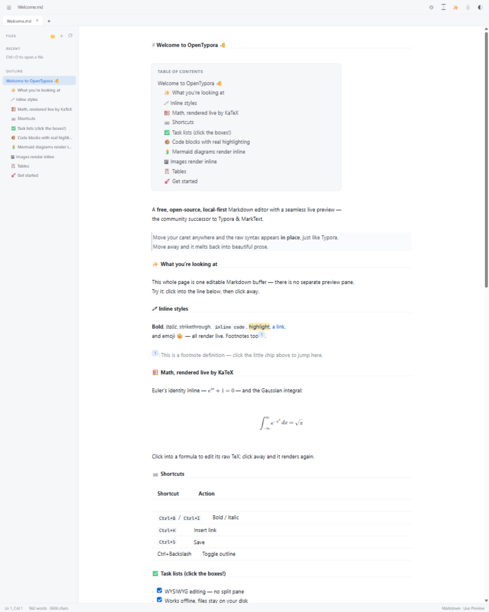
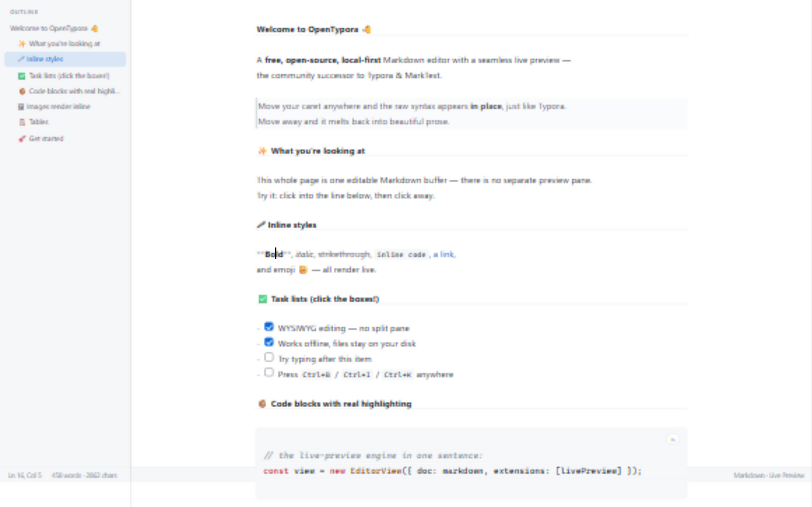
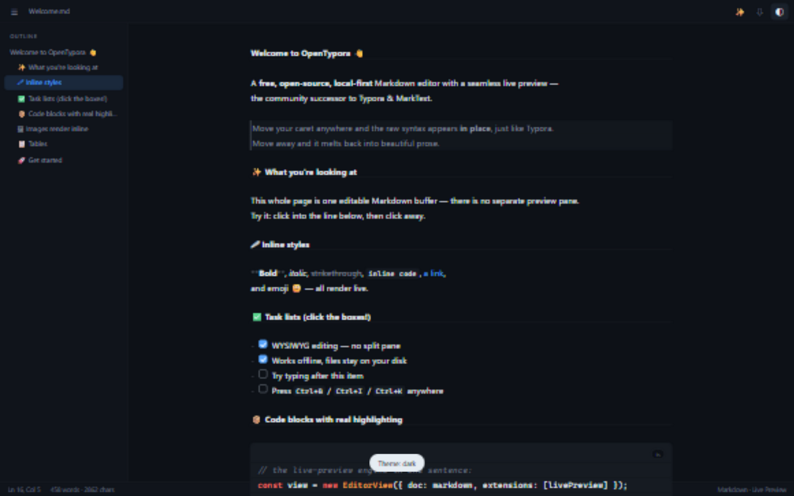
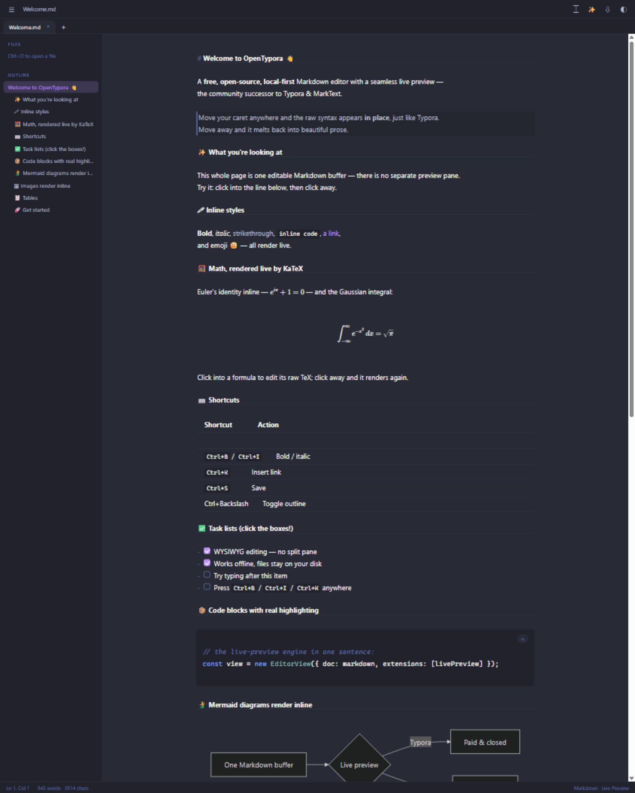
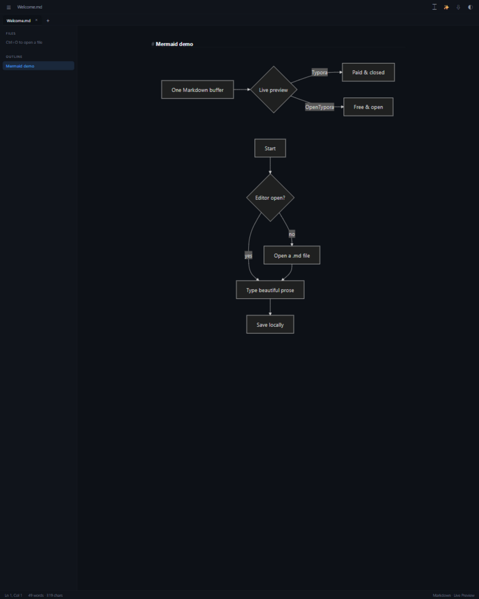
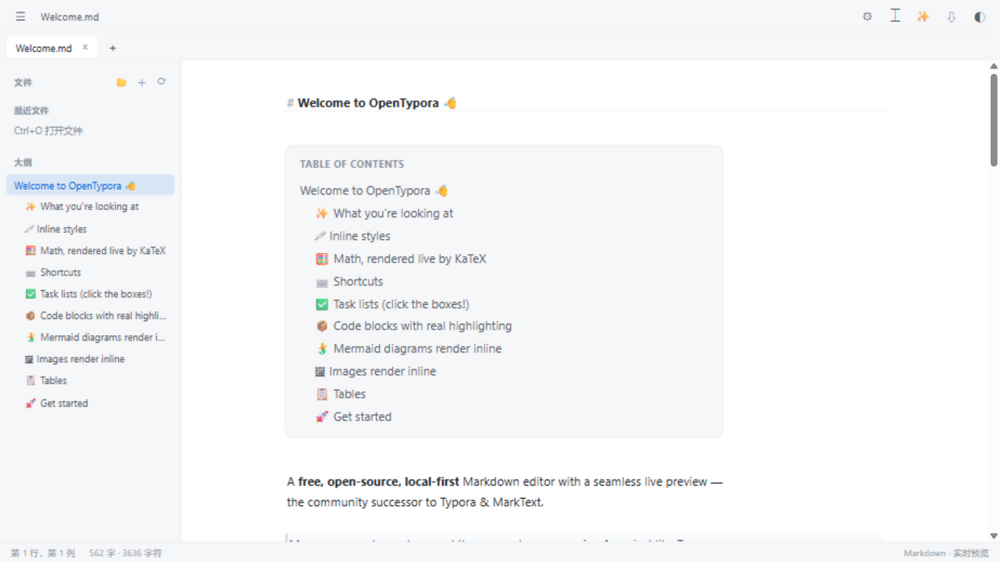

<div align="center">


# Inkstone

**The free, open-source, local-first WYSIWYG Markdown editor.**
The community successor to [Typora](https://typora.io) & [MarkText](https://github.com/marktext/marktext).

[](LICENSE)
[](../../actions/workflows/ci.yml)
[](CONTRIBUTING.md)

*English · [简体中文](README.zh-CN.md)*

</div>

---



Move your caret anywhere and the raw Markdown appears **in place** — move away and it melts back into beautiful prose. No split pane, no preview window, no toggle. Just you and the text.



<details>
<summary><b>More screenshots</b> (dark theme · Dracula · Mermaid · 简体中文)</summary>






</details>

## Why

Typora is lovely but **paid and closed-source**. MarkText was the beloved free alternative — **unmaintained since 2022** with 53k+ stars worth of users still looking for a home. Inkstone takes the baton:

|                    | Typora        | MarkText        | **Inkstone**     |
| ------------------ | ------------- | --------------- | ------------------ |
| Seamless WYSIWYG   | ✅            | ✅              | ✅                 |
| Math & tables      | ✅            | ✅              | ✅                 |
| Price              | paid          | free            | **free, forever**  |
| Source             | closed        | open (dormant)  | **open, active**   |
| Local-first        | ✅            | ✅              | ✅                 |
| Runs in a browser  | ❌            | ❌              | ✅ (PWA)           |
| Bring-your-own-key AI | ❌         | ❌              | ✅                 |
| Telemetry          | —             | none            | **none**           |

## Features

- **🖱 True seamless live preview** — headings, emphasis, links, images, task lists and rules render as you type; syntax appears only where your caret is
- **🧮 KaTeX math** — `$…$` inline and `$$…$$` display formulas, rendered live via a custom Lezer inline parser
- **🧜 Mermaid diagrams** — ` ```mermaid ` blocks render as flowcharts & graphs, re-theming with the app
- **📋 Styled GFM tables** — real headers, column alignment from the delimiter row, and the raw `|---|` separator hidden until you edit
- **🗂 Multi-tab workspace** — every tab keeps its own undo history, cursor & viewport; recent files reopen with one click (handles persisted in IndexedDB)
- **📂 Folder workspace** — open a directory as a file tree in the sidebar, browse, create files and open them as tabs; persisted across sessions
- **⚙ Editor preferences** — content font, size, column width, and a Typora-style **custom CSS** override for everything else
- **🖍 `==highlight==`** and **[^footnotes]** — chips jump to their definition
- **🖼 Inline images** — paste from clipboard; inside a folder workspace they are saved to `assets/` and referenced by relative path (Typora-style), otherwise embedded offline as data URLs
- **📑 Auto table of contents** — write `[toc]` on a line and get a live, clickable contents box that follows your headings
- **✅ Interactive checkboxes** — click to toggle `- [ ]` / `- [x]`
- **📦 Syntax-highlighted code blocks** with a clean language chip (100+ languages)
- **🌓 Five themes** — Light, Dark, Solarized, Nord & Dracula, plus auto (system)
- **⌨️ Typewriter mode** & document outline with click-to-jump (`Ctrl+\`)
- **💾 Real file handling** — open / save / save-as `.md`; in-place saving on Chrome, Edge & the desktop app
- **📄 Export** — self-contained HTML, **Word (.doc)**, **LaTeX (.tex)**, **ePub 3 (.epub)** with a navigable table of contents, or Print → PDF — all offline
- **📲 Installable PWA** — works fully offline; install it from the browser like a native app
- **✨ AI assist (optional)** — polish, translate (EN ⇄ 中文), summarize — with *your own* OpenAI-compatible API key, **including one-click presets for local Ollama & LM Studio**. Nothing leaves your machine except the text you choose.
- **🌍 i18n** — UI in English, 简体中文 & 日本語 (auto-detected, switchable; adding a language is one object)
- **⌨️ Typora-style shortcuts** — `Ctrl+B` / `Ctrl+I` / `Ctrl+E` / `Ctrl+K` toggle around words, `Enter` continues lists & quotes, `Ctrl+S` saves
- **📦 Tiny core** — the whole editor is ~40 kB gzipped (excluding language packs & KaTeX), no Electron in sight when running in a browser

## Quick start

### In your browser (zero install)

```bash
git clone https://github.com/loserYan/Inkstone
cd Inkstone
npm install
npm run dev          # → http://localhost:1420
```

Chrome / Edge get full in-place file saving via the File System Access API.

### Desktop app (Tauri 2)

```bash
npm run build         # web assets
cd src-tauri && cargo tauri build
```

Prebuilt binaries for Windows, macOS and Linux are published on the [releases page](../../releases) by CI. Requires [Rust](https://rustup.rs) to build from source.

## Keyboard shortcuts

| Shortcut      | Action                  |
| ------------- | ----------------------- |
| `Ctrl+O`      | Open a Markdown file    |
| `Ctrl+S`      | Save / save as          |
| `Ctrl+B`      | Bold (toggle)           |
| `Ctrl+I`      | Italic (toggle)         |
| `Ctrl+E`      | Inline code (toggle)    |
| `Ctrl+Shift+X`| Strikethrough (toggle)  |
| `Ctrl+K`      | Insert link             |
| `Ctrl+\`      | Toggle outline          |
| `Ctrl+F`      | Search                  |

## How it works

There is **no second rendering surface**. The document is always one CodeMirror 6 buffer; a decoration plugin walks the Lezer syntax tree and

- collapses syntax markers (`#`, `**`, `` ` ``, `>`, `](…)`) with `Decoration.replace` whenever the caret is outside their node,
- styles blocks (headings, quotes, code fences) with line decorations,
- swaps images, task checkboxes and rules for live widgets.

When your caret enters a construct, its decorations lift and the raw syntax shows through — that's the whole trick, and it keeps copy/paste, search, undo and accessibility 100% intact because the buffer *is* the source of truth. See [`src/editor/livePreview.ts`](src/editor/livePreview.ts).

## Roadmap

- [x] KaTeX math (`$…$` / `$$…$$`)
- [x] Styled GFM tables
- [x] Mermaid diagrams
- [x] Multi-tab workspace & recent files
- [x] Folder workspace (file tree)
- [x] `==highlight==` & footnotes
- [x] Five built-in themes + typewriter mode
- [x] Editor preferences + custom CSS
- [x] PWA — installable & offline
- [x] Image assets saved to workspace `assets/` with relative paths
- [x] `[toc]` auto table of contents
- [x] Export to Word / LaTeX / ePub
- [x] Offline unit tests (`npm test`)
- [ ] Full theme gallery / importable themes
- [ ] Local AI via WebLLM (in-browser weights)
- [x] i18n UI (en / zh-CN / ja)

## Contributing

Issues and PRs are very welcome — this project exists because its predecessors stopped. See [CONTRIBUTING.md](CONTRIBUTING.md).

## Acknowledgments

- [Typora](https://typora.io) for defining what a Markdown editor should feel like (Inkstone is an independent project, not affiliated with or endorsed by Typora)
- [MarkText](https://github.com/marktext/marktext) for years of free excellence
- [CodeMirror 6](https://codemirror.net) — the editor kernel that makes this architecture possible

## License

[MIT](LICENSE) © inkstone contributors
