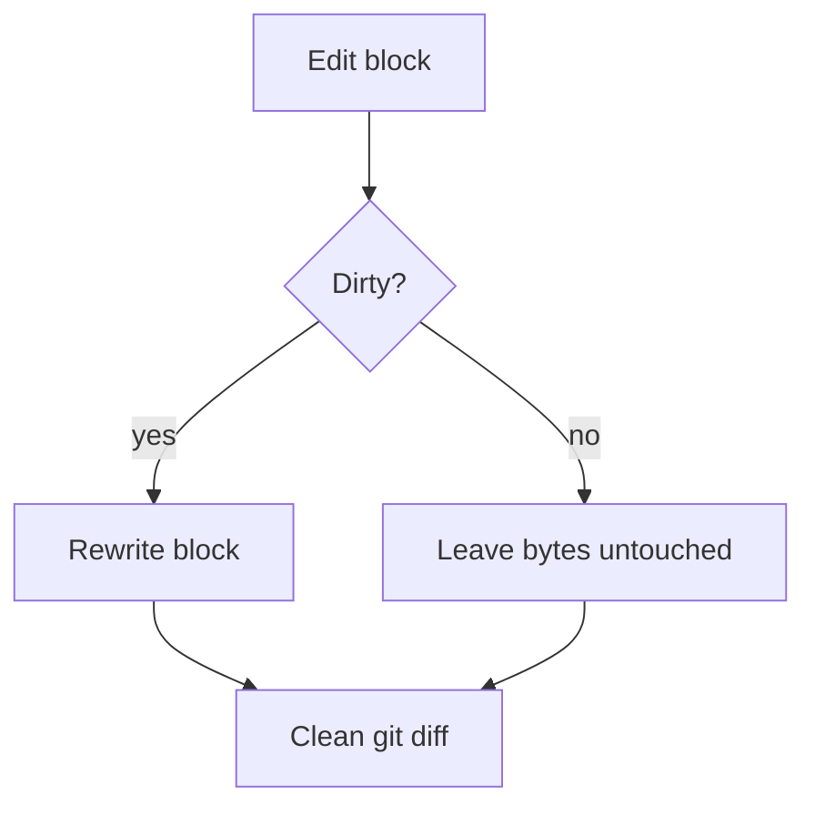

# Diagrams

The save pipeline:



An ordinary fenced block for contrast:

```ts
const state = EditorState.create({ doc, extensions });
console.log(state.doc.toString() === doc);
```

A tilde fence containing a fake heading that must not be picked up:

~~~text
# not a heading
~~~

End of file.
